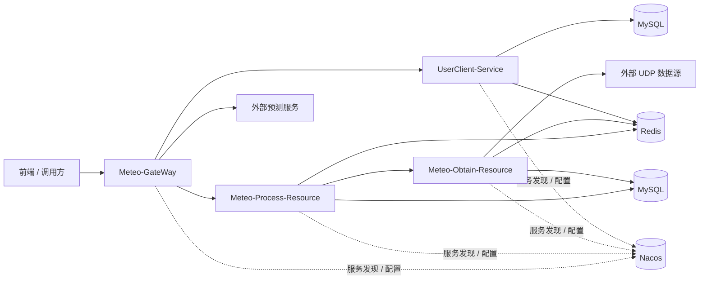
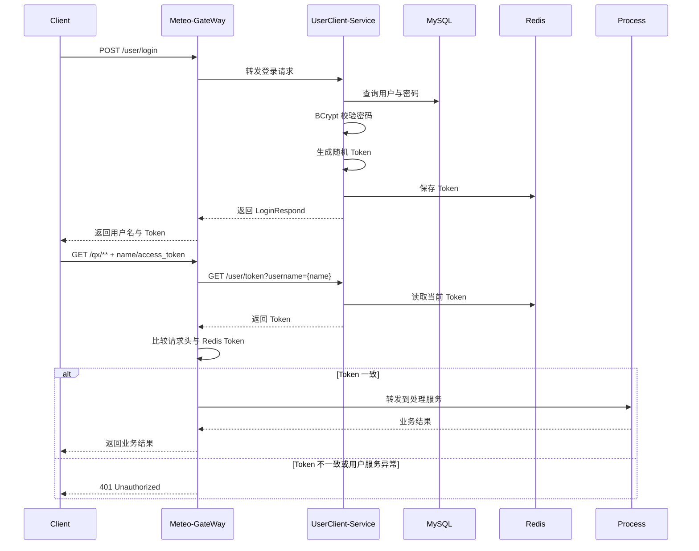
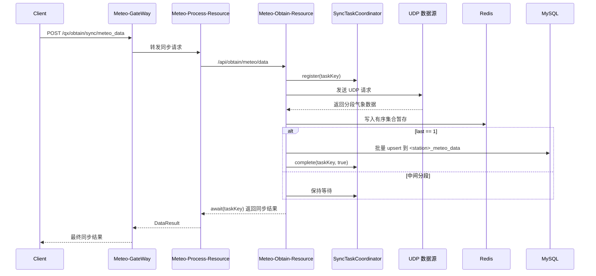

# MeteoDataProcessServer 系统设计文档

## 1. 建设背景

项目服务于气象数据分析预测系统的后端能力建设，核心目标是把外部 UDP 数据源提供的站点与气象数据，转换为可被前端、业务系统和预测服务稳定访问的 HTTP 微服务接口。

系统当前重点覆盖以下问题：

1. UDP 数据源回包是异步的，而业务接口需要同步结果。
2. 气象数据天然带有站点、日期和时间维度，需要兼顾高频写入与高频查询。
3. 多个服务模块之间需要统一鉴权、统一配置和统一返回结构。
4. 预测服务是外部系统，但调用方希望从统一网关入口访问。

## 2. 设计目标

### 2.1 功能目标

- 提供统一用户认证与访问令牌机制。
- 提供站点、采集日期、小时/天/区间/复杂条件等查询能力。
- 提供站点、日期范围和气象明细同步能力。
- 对外暴露稳定的网关入口，并支持预测服务接入。

### 2.2 工程目标

- 通过公共模块减少重复配置和重复实现。
- 通过 Redis 缓冲和缓存提升采集与查询效率。
- 通过动态分表控制单站点数据访问范围。
- 通过配置化方式降低环境切换成本。

## 3. 上下游边界

| 角色 | 边界说明 |
| --- | --- |
| 前端/调用方 | 通过 `Meteo-GateWay` 调用 `/user/**`、`/qx/**`、`/anapredict/**` |
| 外部 UDP 数据源 | 采集服务使用 Netty UDP 客户端访问，返回站点、日期范围与气象明细 |
| 外部预测服务 | 网关仅做路由转发，本仓库不包含预测逻辑 |
| Nacos | 提供服务注册发现与共享配置 |
| MySQL | 存储用户信息、站点信息、站点日期、站点动态气象明细 |
| Redis | 存储 Token、采集暂存数据、查询缓存 |

## 4. 总体架构

### 4.1 模块职责

| 模块 | 主要职责 | 关键实现 |
| --- | --- | --- |
| `Meteo-GateWay` | 统一入口、跨域、令牌校验、路由分发 | `TokenAuthenticationGatewayFilterFactory`、`CorsConfig` |
| `UserClient-Service` | 用户注册、登录、退出、Token 查询 | `UserServiceImpl`、`UserRedisImpl` |
| `Meteo-Process-Resource` | 查询、统计、同步编排、缓存 | `MeteorologyServiceImpl`、`StationServiceImpl`、`MeteorologySyncServiceImpl` |
| `Meteo-Obtain-Resource` | UDP 通信、报文处理、落 Redis/MySQL | `UDPClient`、`UdpResponseProcessor`、`SyncTaskCoordinator` |
| `meteo-common` | 统一响应、异常处理、配置、常量 | `DataResult`、`GlobalExceptionHandler`、`ServiceClientProperties` |

## 5. 核心时序

### 5.1 登录与网关鉴权时序

### 5.2 气象数据同步时序

### 5.3 查询路径说明

1. `/qx/stat_hour`、`/qx/stat_day`、`/qx/stat_day_range` 先构建查询条件对象。
2. `MeteorologyServiceImpl` 根据站点编码调用 `StationTableNameResolver` 生成目标表名。
3. 优先查询 Redis 缓存，未命中时访问 MySQL。
4. 查询结果转换为统一二维数组结构后回写 Redis。

## 6. 数据模型

### 6.1 MySQL 模型

| 表/对象 | 说明 | 关键字段 |
| --- | --- | --- |
| `user` | 用户基础信息 | `username`、加密密码 |
| `station` | 站点主数据 | `station`、`name` |
| `station_date` | 站点已采集日期 | `station`、`date` |
| `<station>_meteo_data` | 站点气象明细动态表 | `date`、`datetime`、`time`、`temperature`、`humidity`、`speed`、`direction`、`rain`、`sunlight`、`pm25`、`pm10` |

### 6.2 动态气象表设计

- 每个站点单独落一个 `<station>_meteo_data` 表。
- 表由 `SaveToMySQLMapper.createMeteoDataTableIfNotExists` 自动创建。
- 通过 `datetime` 唯一键实现幂等写入。
- `insertMeteoData` 使用 `ON DUPLICATE KEY UPDATE` 完成重入更新。

### 6.3 Redis 模型

| Key 前缀 | 用途 |
| --- | --- |
| `meteo:user:token:{username}` | 用户访问令牌 |
| `Meteo-UserClient-User` | 用户令牌 Hash 索引 |
| `meteo:obtain:token:{username}` | 采集服务 Token |
| `tokens` | 采集 Token Hash 索引 |
| `meteo:station:date-range:{station}` | 站点已采集日期集合 |
| `meteo:station:data:{station}:{date}` | 气象明细暂存有序集合 |
| `meteo:cache:*` | 处理服务查询缓存 |

### 6.4 统一返回模型

| 类型 | 字段 | 语义 |
| --- | --- | --- |
| `DataResult` | `success`、`data` | 通用业务成功/失败 |
| `MeteorologyResult` | `success`、`station`、`total`、`data` | 气象查询结果 |
| `StationResult` | `success`、`station` | 站点信息 |

`success` 统一由 `ApiStatus` 定义，成功为 `1`，失败为 `0`。

## 7. 缓存设计

### 7.1 查询缓存

处理服务使用 `RedisRepositoryImpl` 对以下查询结果缓存：

- 小时查询
- 单日查询
- 日期范围查询

缓存键由以下维度组合而成：

- `app.cache.prefix`
- 查询类型
- 动态表名
- 开始时间
- 结束时间
- 类型参数
- 指标选择参数
- 分页参数

默认 TTL 由 `app.cache.meteorology-ttl` 控制，当前默认值为 `PT10M`。

### 7.2 采集阶段暂存

- UDP 返回的单条气象记录先写入 Redis 有序集合。
- 分值使用 `Asia/Shanghai` 时区下的 Unix 时间戳，保证时间顺序。
- 收到 `last == 1` 的最后分片后触发 MySQL 批量落库。

### 7.3 Token 存储

- 用户访问令牌支持 TTL，可根据 `app.security.token-ttl` 配置。
- 采集服务 Token 同时保存用户名对应键和值索引 Hash，便于共享默认采集账号 Token。

## 8. 鉴权设计

### 8.1 入口鉴权

- 仅 `/user/**` 路由默认不经网关 Token 过滤器。
- `/qx/**` 与 `/anapredict/**` 使用统一 Token 过滤器。
- 过滤器从请求头读取 `name` 与 `access_token`。
- 若任一缺失、用户服务不可达或 Token 不匹配，则直接返回 `401 Unauthorized`。

### 8.2 用户认证

- 注册时将密码以 BCrypt 哈希形式持久化。
- 登录时对比哈希密码。
- 登录成功后生成 URL Safe Token 并写入 Redis。
- 注销时同时清理字符串键与 Hash 索引中的 Token。

### 8.3 跨域策略

- 网关通过 `CorsConfig` 统一处理跨域。
- 允许来源、方法和请求头都由 `app.gateway.auth.*` 配置控制。
- 默认允许任意来源，适合开发联调；生产环境应缩小范围。

## 9. 配置与部署

### 9.1 配置前缀

| 前缀 | 模块 | 说明 |
| --- | --- | --- |
| `app.clients.user.*` | 网关 | 调用用户服务 |
| `app.clients.obtain.*` | 处理服务 | 调用采集服务 |
| `app.clients.ana-predict.*` | 网关 | 调用预测服务 |
| `app.cache.*` | 处理服务 | 查询缓存 |
| `app.gateway.auth.*` | 网关 | 鉴权与跨域 |
| `app.security.*` | 用户服务 | Token 与密码策略 |
| `app.udp.*` | 采集服务 | UDP 地址、认证账号与等待超时 |

### 9.2 默认端口

| 服务 | 端口 |
| --- | --- |
| `Meteo-GateWay` | `9094` |
| `UserClient-Service` | `9194` |
| `Meteo-Process-Resource` | `9394` |
| `Meteo-Obtain-Resource` | `9494` |
| 预测服务（外部） | `9594` |

### 9.3 部署建议

1. 先部署 Nacos、Redis、MySQL。
2. 部署 `UserClient-Service`，保证网关与业务服务能完成 Token 校验。
3. 部署 `Meteo-Obtain-Resource`，确保 UDP 通道联通。
4. 部署 `Meteo-Process-Resource`，承接查询与同步编排。
5. 最后部署 `Meteo-GateWay` 对外提供统一入口。

## 10. 异常与容错

### 10.1 参数与校验异常

- `GlobalExceptionHandler` 统一处理 `MethodArgumentNotValidException`、`ConstraintViolationException`、缺少参数和类型错误。
- 控制层大量使用 `@Validated`、`@Pattern`、`@Min`、`@NotBlank` 等注解进行前置校验。

### 10.2 动态表名保护

- `StationTableNameResolver` 只允许字母和数字形式的站点编码。
- 非法站点编码直接抛出 `IllegalArgumentException`，由全局异常处理器包装为失败结果返回。

### 10.3 采集超时与失败

- `SyncTaskCoordinator.await` 使用 `app.udp.await-timeout` 控制等待时长。
- 出现超时、线程中断或执行异常时直接返回失败。
- `finally` 块中清理任务映射，避免 Future 泄漏。

### 10.4 下游异常降级

- 网关令牌过滤器对用户服务调用异常按未授权处理。
- 处理服务和采集服务的内部远程调用以布尔值或失败响应对外显式返回，避免把底层异常直接透出。

### 10.5 数据幂等

- `station` 和 `station_date` 插入语句都带有“存在即不插入”的保护。
- 气象明细表使用 `datetime` 唯一键和 `ON DUPLICATE KEY UPDATE`，避免重复导入导致脏数据。
- `database/compatibility/20260318_schema_hardening.sql` 用于补齐唯一索引和辅助索引。

## 11. 测试策略

当前仓库已落地的自动化测试聚焦在高风险行为上：

| 测试类 | 关注点 |
| --- | --- |
| `TokenAuthenticationGatewayFilterFactoryTest` | 网关是否正确放行合法 Token、拦截非法 Token |
| `UserServiceImplTest` | 登录成功时是否保存 Token、重复注册是否被拒绝 |
| `SyncTaskCoordinatorTest` | 异步任务是否能被正确完成与唤醒 |
| `MeteorologySyncServiceImplTest` | 无站点时日期范围同步是否正确失败 |
| `StationTableNameResolverTest` | 动态表名解析是否拦截非法站点编码 |

建议在后续演进中继续补充：

- 复杂查询的 Mapper/Service 集成测试。
- UDP 响应报文解析测试。
- Redis 缓存键与 TTL 的行为测试。
- 网关到用户服务的联调测试。

## 12. 已知限制与后续演进

### 12.1 当前限制

- 预测服务不在本仓库，需要单独部署和维护。
- 文档化接口目前主要依赖 README 和代码命名，尚未接入 OpenAPI/Swagger。
- 日期范围同步仍按站点串行处理，大规模站点时吞吐有限。
- 观测性能力较弱，缺少统一日志、指标和链路追踪方案。

### 12.2 后续演进方向

1. 为查询接口和同步接口补充更完整的集成测试和契约测试。
2. 引入标准化 API 文档生成机制。
3. 对同步任务引入并发队列、重试与失败补偿机制。
4. 为缓存命中率、UDP 同步时延、MySQL 落库耗时补充监控指标。
5. 逐步将预测服务也纳入统一配置、统一监控和统一发布链路。
